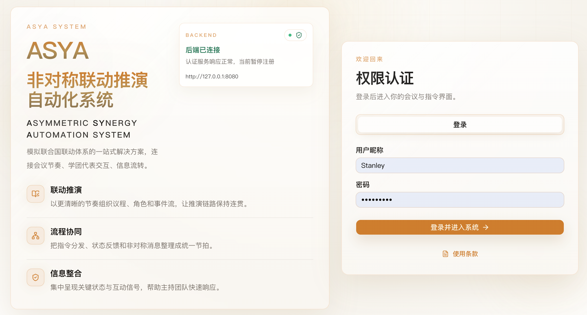
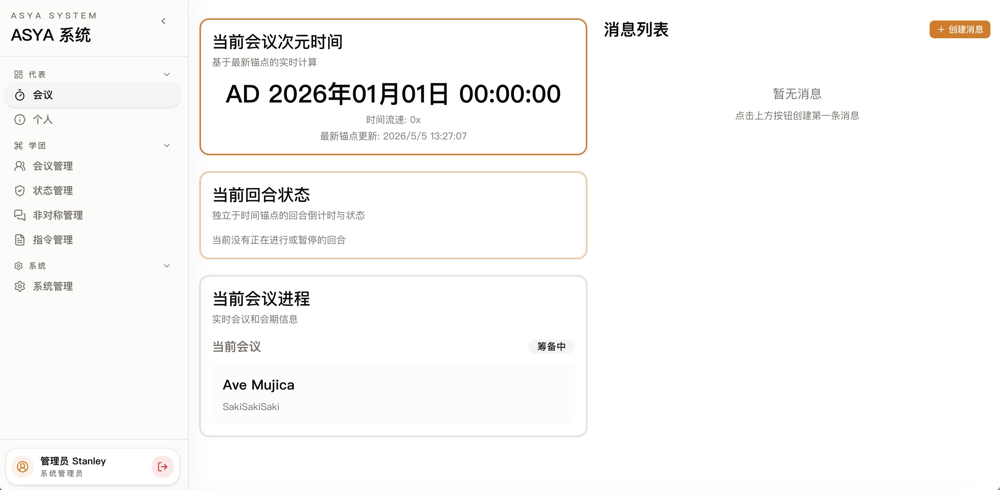

<p align="center">
  
</p>

# ASYA: 非对称联动自动化系统

**非对称联动自动化系统**（**ASYA System**，Asymmetric SYnergy Automation System）是一款模拟联合国联动体系一站式解决方案。

项目期望以信息化的手段，逐渐改善传统模拟联合国联动会场中，由于代表与学团之间信息交互渠道不足而导致的参会体验问题。





## 部署指南

如果你只是想部署并运行 ASYA，直接使用已经发布到 DockerHub 的镜像即可。

使用前请先准备好 Docker 和 Docker Compose，然后在项目根目录执行：
```bash
sudo docker compose up -d
```

默认项目会启动在 ``3000`` 端口，后端服务与 websocket 提醒会占用 ``8080`` 端口，请确保这两个端口未被占用，或修改 ``docker-compose.yml`` 配置

其中：

- ``3000`` 用于前端页面访问；
- ``8080`` 用于容器内后端接口与代表端 websocket 提醒连接。

如果你想指定某个版本，或者改用你自己的镜像地址，可以在执行前覆盖 `ASYA_IMAGE`，例如：

```bash
ASYA_IMAGE=stanleyzh/asya-mun:v0.9.2 sudo docker compose up -d
```

## 许可证

本项目基于 **PolyForm Shield License 1.0.0** 授权。

你可以在 PolyForm Shield 的条款下使用本软件。具体条款请查看 [LICENSE](./LICENSE) 文件。

在 PolyForm Shield 下，开发者授予你如下几项版权许可：

- 将本软件用于个人、学习、研究等非竞争性目的；
- 阅读和学习源代码；
- 修改本软件；
- 在非竞争性目的下，再分发原始版本或修改后的版本（需遵守许可证条款）。

需要注意的是，你不得使用本软件提供与 ASYA 或其开发者的任何产品**相竞争的产品或服务**。具体竞争定义请参阅许可证全文。

如果你的使用场景涉及提供竞争性产品，如其他模拟联合国会议软件，请书面联系[开发者](mailto:acc_stanley@foxmail.com)获取额外授权。

### 商标与品牌

本项目的名称、Logo、视觉标识、域名以及其他品牌资产，除非另有明确说明，不随许可证一并授权。

未经许可，不得使用 ASYA 的名称或品牌元素来暗示官方认可、合作关系或授权关系。

## 官方服务免责声明与使用条款

访问或使用由开发者提供的 [ASYA 官方在线服务](https://mun.bearingwall.top) 前，你应当知悉并遵守 [ASYA 官方在线服务免责声明与使用条款](./docs/official-eula.md) 所载的所有条款。
